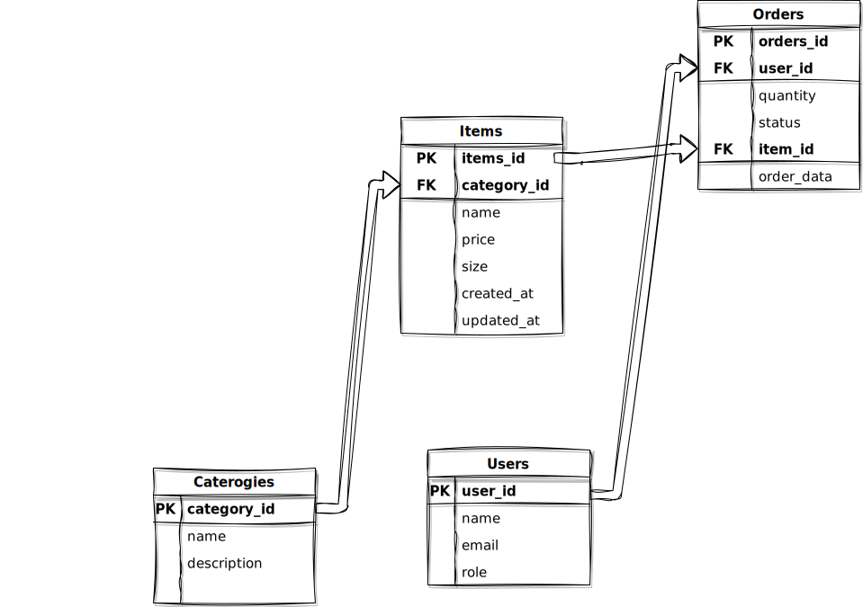

# Documentation




```markdown
# EDRProjectt

This project involves the design of a database system for managing users, categories, items, and orders. The database is built using both SQL (MySQL) and NoSQL (MongoDB) to demonstrate the implementation of the entities, relationships, and basic operations.

## Step 1: Database Design (ERD)

### Entities:
1. **Users**
   - Attributes: `user_id (PK)`, `name`, `email`, `role` (e.g., "admin" or "user").
   
2. **Categories**
   - Attributes: `category_id (PK)`, `name`, `description`.

3. **Items**
   - Attributes: `item_id (PK)`, `name`, `price`, `size`, `category_id (FK)`, `created_at`, `updated_at`.

4. **Orders**
   - Attributes: `order_id (PK)`, `user_id (FK)`, `item_id (FK)`, `quantity`, `status` (e.g., "Pending", "Approved", "Disapproved"), `order_date`.

### Relationships:
- **Users to Orders**: One-to-Many (One user can place many orders).
- **Categories to Items**: One-to-Many (One category can have many items).
- **Items to Orders**: One-to-Many (One item can appear in many orders).

## Step 2: SQL Script

### a) Create the Entities:

```sql
CREATE TABLE Users (
    user_id INT AUTO_INCREMENT PRIMARY KEY,
    name VARCHAR(255) NOT NULL,
    email VARCHAR(255) UNIQUE NOT NULL,
    role ENUM('admin', 'user') NOT NULL
);

CREATE TABLE Categories (
    category_id INT AUTO_INCREMENT PRIMARY KEY,
    name VARCHAR(255) NOT NULL,
    description TEXT
);

CREATE TABLE Items (
    item_id INT AUTO_INCREMENT PRIMARY KEY,
    name VARCHAR(255) NOT NULL,
    price DECIMAL(10, 2) NOT NULL,
    size ENUM('small', 'medium', 'large') NOT NULL,
    category_id INT,
    created_at TIMESTAMP DEFAULT CURRENT_TIMESTAMP,
    updated_at TIMESTAMP DEFAULT CURRENT_TIMESTAMP ON UPDATE CURRENT_TIMESTAMP,
    FOREIGN KEY (category_id) REFERENCES Categories(category_id)
);

CREATE TABLE Orders (
    order_id INT AUTO_INCREMENT PRIMARY KEY,
    user_id INT,
    item_id INT,
    quantity INT NOT NULL,
    status ENUM('Pending', 'Approved', 'Disapproved') DEFAULT 'Pending',
    order_date TIMESTAMP DEFAULT CURRENT_TIMESTAMP,
    FOREIGN KEY (user_id) REFERENCES Users(user_id),
    FOREIGN KEY (item_id) REFERENCES Items(item_id)
);
```

### b) Insert Records:

```sql
-- Insert Users
INSERT INTO Users (name, email, role) VALUES
('Alice', 'alice@example.com', 'admin'),
('Bob', 'bob@example.com', 'user');

-- Insert Categories
INSERT INTO Categories (name, description) VALUES
('Electronics', 'Electronic gadgets and devices'),
('Clothing', 'Apparel and clothing items');

-- Insert Items
INSERT INTO Items (name, price, size, category_id) VALUES
('Laptop', 999.99, 'medium', 1),
('T-Shirt', 19.99, 'small', 2);

-- Insert Orders
INSERT INTO Orders (user_id, item_id, quantity, status) VALUES
(2, 1, 1, 'Pending'),
(2, 2, 2, 'Pending');
```

### c) Query Records:

```sql
-- Fetch all items with their categories
SELECT i.name AS item_name, c.name AS category_name
FROM Items i
JOIN Categories c ON i.category_id = c.category_id;

-- Fetch all orders with user and item details
SELECT o.order_id, u.name AS user_name, i.name AS item_name, o.quantity, o.status
FROM Orders o
JOIN Users u ON o.user_id = u.user_id
JOIN Items i ON o.item_id = i.item_id;
```

### d) Update Records:

```sql
-- Update item price and size
UPDATE Items
SET price = 1099.99, size = 'large'
WHERE name = 'Laptop';

-- Update order status
UPDATE Orders
SET status = 'Approved'
WHERE order_id = 1;
```

### e) Delete Records:

```sql
-- Delete a specific order
DELETE FROM Orders WHERE order_id = 2;

-- Delete a category (cascade effect deletes dependent items)
DELETE FROM Categories WHERE category_id = 1;
```

## Step 3: NoSQL Script (MongoDB)

### a) Create Entities:

```javascript
// Create Users Collection
db.Users.insertMany([
    { user_id: 1, name: "Alice", email: "alice@example.com", role: "admin" },
    { user_id: 2, name: "Bob", email: "bob@example.com", role: "user" }
]);

// Create Categories Collection
db.Categories.insertMany([
    { category_id: 1, name: "Electronics", description: "Electronic gadgets and devices" },
    { category_id: 2, name: "Clothing", description: "Apparel and clothing items" }
]);

// Create Items Collection
db.Items.insertMany([
    { item_id: 1, name: "Laptop", price: 999.99, size: "medium", category_id: 1 },
    { item_id: 2, name: "T-Shirt", price: 19.99, size: "small", category_id: 2 }
]);

// Create Orders Collection
db.Orders.insertMany([
    { order_id: 1, user_id: 2, item_id: 1, quantity: 1, status: "Pending" },
    { order_id: 2, user_id: 2, item_id: 2, quantity: 2, status: "Pending" }
]);
```

### b) Query Records:

```javascript
// Fetch items with their categories
db.Items.aggregate([
    { $lookup: {
        from: "Categories",
        localField: "category_id",
        foreignField: "category_id",
        as: "category_details"
    }}
]);

// Fetch orders with user and item details
db.Orders.aggregate([
    { $lookup: {
        from: "Users",
        localField: "user_id",
        foreignField: "user_id",
        as: "user_details"
    }},
    { $lookup: {
        from: "Items",
        localField: "item_id",
        foreignField: "item_id",
        as: "item_details"
    }}
]);
```

### c) Update Records:

```javascript
// Update item price and size
db.Items.updateOne(
    { name: "Laptop" },
    { $set: { price: 1099.99, size: "large" } }
);

// Update order status
db.Orders.updateOne(
    { order_id: 1 },
    { $set: { status: "Approved" } }
);
```

### d) Delete Records:

```javascript
// Delete a specific order
db.Orders.deleteOne({ order_id: 2 });

// Delete a category (and manually delete dependent items if necessary)
db.Categories.deleteOne({ category_id: 1 });
```

## Step 4: Submit the Assignment

1. **ERD Diagram**: Use an ERD tool like [Lucidchart](https://www.lucidchart.com/), [draw.io](https://app.diagrams.net/), or [dbdiagram.io](https://dbdiagram.io/). Share the public link of the ERD diagram.
2. **SQL & NoSQL Scripts**: Paste all SQL and NoSQL scripts into a [Google Docs](https://docs.google.com/) document and ensure the document is accessible by sharing the link.

---

### Additional Notes
Feel free to reach out if you need any further clarifications or assistance with the database setup or queries.

```

